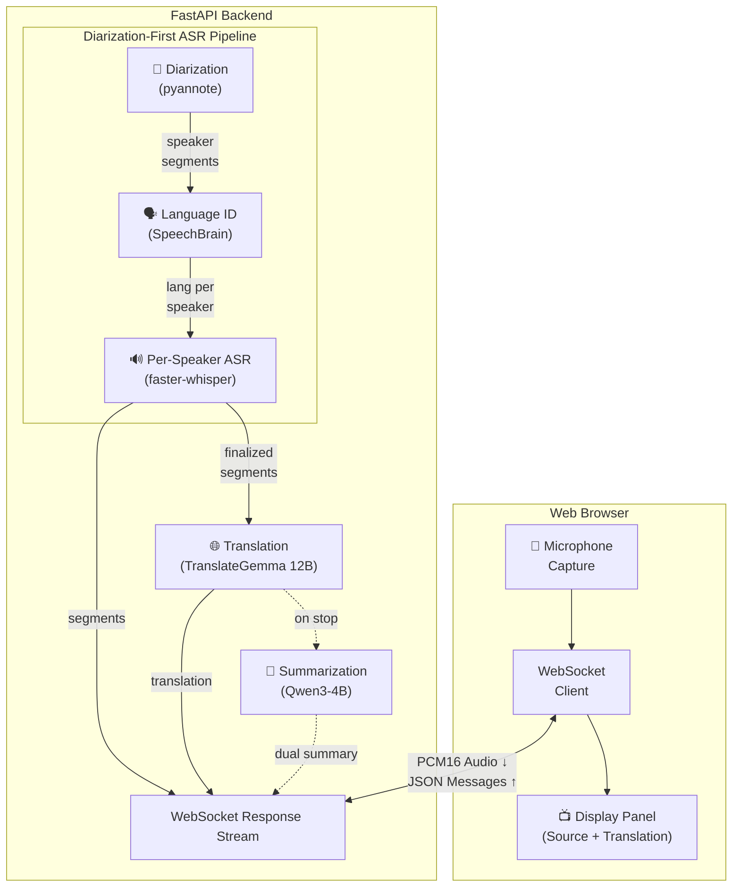

# LinguaGap

[](https://github.com/johannhartmann/linguagap/actions/workflows/ci.yml)
[](https://codecov.io/gh/johannhartmann/linguagap)
[](https://www.python.org/downloads/)
[](https://opensource.org/licenses/MIT)
[](https://github.com/astral-sh/ruff)
[](https://github.com/pre-commit/pre-commit)
[](https://github.com/PyCQA/bandit)
[](https://hub.docker.com/)
[](https://developer.nvidia.com/cuda-toolkit)

Real-time speech transcription and translation system using GPU-accelerated ASR and MT models.

## Features

- **Real-time ASR** - Speech-to-text using faster-whisper (CTranslate2) with GPU acceleration
- **Speaker Diarization** - Identify who's speaking using pyannote community pipeline
- **Per-Speaker Language Detection** - SpeechBrain VoxLingua107 detects each speaker's language
- **LLM Translation** - High-quality translation using TranslateGemma 12B via llama-cpp-python
- **Bilingual Summarization** - Generate dual-language summaries using Qwen3-4B
- **WebSocket Streaming** - Low-latency segment-based updates with decoupled ASR/MT
- **Web Interface** - Browser-based microphone capture and real-time display
- **Multi-language** - Support for 17+ languages with auto-detection
- **GPU Optimized** - CUDA 12.9 with optimized inference for Blackwell GPUs

## Quick Start

### Prerequisites

- Docker and Docker Compose v2
- NVIDIA GPU with driver >= 525.60.13
- [NVIDIA Container Toolkit](https://docs.nvidia.com/datacenter/cloud-native/container-toolkit/install-guide.html)

### Verify GPU Access

```bash
docker run --rm --gpus all nvidia/cuda:12.9.0-runtime-ubuntu24.04 nvidia-smi
```

### Start the Service

```bash
# Build and start
docker compose up --build backend

# Open web interface
open http://localhost:8000
```

## Architecture

The system uses a **diarization-first pipeline** for accurate multilingual transcription:



### Model Stack

| Component | Model | Purpose |
|-----------|-------|---------|
| ASR | faster-whisper-large-v3-turbo | Speech-to-text transcription |
| Diarization | pyannote-audio 4.x (community-1) | Speaker identification |
| Language ID | SpeechBrain VoxLingua107 ECAPA-TDNN | Per-speaker language detection |
| Translation | TranslateGemma 12B (GGUF) | Specialized translation model |
| Summarization | Qwen3-4B (GGUF) | Bilingual summary generation |

## Environment Variables

| Variable | Default | Description |
|----------|---------|-------------|
| `ASR_MODEL` | `deepdml/faster-whisper-large-v3-turbo-ct2` | Whisper model |
| `ASR_DEVICE` | `cuda` | ASR device (cuda/cpu) |
| `ASR_COMPUTE_TYPE` | `int8_float16` | ASR compute type |
| `DIARIZATION_MODEL` | `pyannote/speaker-diarization-community-1` | Speaker diarization |
| `DIARIZATION_NUM_SPEAKERS` | `2` | Expected speakers (bilingual) |
| `LANG_ID_MODEL` | `speechbrain/lang-id-voxlingua107-ecapa` | Language detection |
| `MT_MODEL_REPO` | `bullerwins/translategemma-12b-it-GGUF` | Translation model repo |
| `MT_MODEL_FILE` | `translategemma-12b-it-Q4_K_M.gguf` | Translation model file |
| `SUMM_MODEL_REPO` | `Qwen/Qwen3-4B-GGUF` | Summarization model repo |
| `SUMM_MODEL_FILE` | `Qwen3-4B-Q4_K_M.gguf` | Summarization model file |
| `MT_N_GPU_LAYERS` | `-1` | GPU layers (-1 = all) |
| `WINDOW_SEC` | `8.0` | Transcription window |
| `TICK_SEC` | `0.5` | Update interval |
| `STABILITY_SEC` | `1.25` | Segment finalization threshold |
| `MAX_BUFFER_SEC` | `30.0` | Max audio buffer |

## API Endpoints

| Endpoint | Method | Description |
|----------|--------|-------------|
| `/` | GET | Web interface |
| `/health` | GET | Health check |
| `/metrics` | GET | Performance metrics |
| `/transcribe_translate` | POST | File upload transcription |
| `/ws` | WebSocket | Real-time streaming |

## Supported Languages

Albanian (sq), Arabic (ar), Bulgarian (bg), Croatian (hr), English (en), French (fr), German (de), Hungarian (hu), Italian (it), Persian (fa), Polish (pl), Romanian (ro), Russian (ru), Serbian (sr), Spanish (es), Turkish (tr), Ukrainian (uk)

## Development

### Setup

```bash
# Install uv
curl -LsSf https://astral.sh/uv/install.sh | sh

# Install dev dependencies
uv sync --only-dev

# Install pre-commit hooks
pre-commit install
```

### Quality Checks

```bash
# Run all pre-commit hooks
pre-commit run --all-files

# Individual checks
uv run ruff check src/           # Linting
uv run ruff format src/          # Formatting
uv run ty check src/             # Type checking
uv run bandit -r src/            # Security scan
uv run pytest tests/ -v          # Tests
```

### Run Tests

```bash
# Run tests with coverage
uv run pytest tests/ -v --cov=src/app --cov-report=term-missing

# Run specific test file
uv run pytest tests/test_streaming_policy.py -v

# Run E2E tests (requires Gemini API key for TTS)
GOOGLE_API_KEY=xxx uv run pytest tests/test_e2e_pipeline.py -v
```

### E2E Testing

End-to-end tests validate the full pipeline using synthetic audio from Gemini TTS:

- **German-Bulgarian dialogue** - Tests bilingual transcription and translation
- **German-Turkish dialogue** - Tests language switching detection
- **Pure German** - Tests diarization without translation

Audio fixtures are cached in `tests/fixtures/e2e_audio/` for reproducibility.

### Docker Development

```bash
# Build and run
docker compose up --build backend

# Run smoke tests
docker compose exec backend python -m app.scripts.asr_smoke
docker compose exec backend python -m app.scripts.mt_smoke
docker compose exec backend python -m app.scripts.pipeline_smoke

# View logs
docker compose logs -f backend

# Check metrics
curl http://localhost:8000/metrics
```

## Troubleshooting

### GPU Not Detected

```bash
# Install NVIDIA Container Toolkit
sudo apt-get install -y nvidia-container-toolkit
sudo systemctl restart docker

# Verify
docker run --rm --gpus all nvidia/cuda:12.9.0-runtime-ubuntu24.04 nvidia-smi
```

### Out of GPU Memory

- Use a smaller ASR model: `ASR_MODEL=tiny`
- Reduce MT GPU layers: `MT_N_GPU_LAYERS=20`

### Slow First Request

Models are loaded on first use. The server warms up models on startup to minimize cold start latency.

### WebSocket Disconnects

- Check firewall settings
- Ensure stable network connection
- View logs: `docker compose logs backend`

## Contributing

See [CONTRIBUTING.md](CONTRIBUTING.md) for guidelines.

## License

[MIT](LICENSE)
