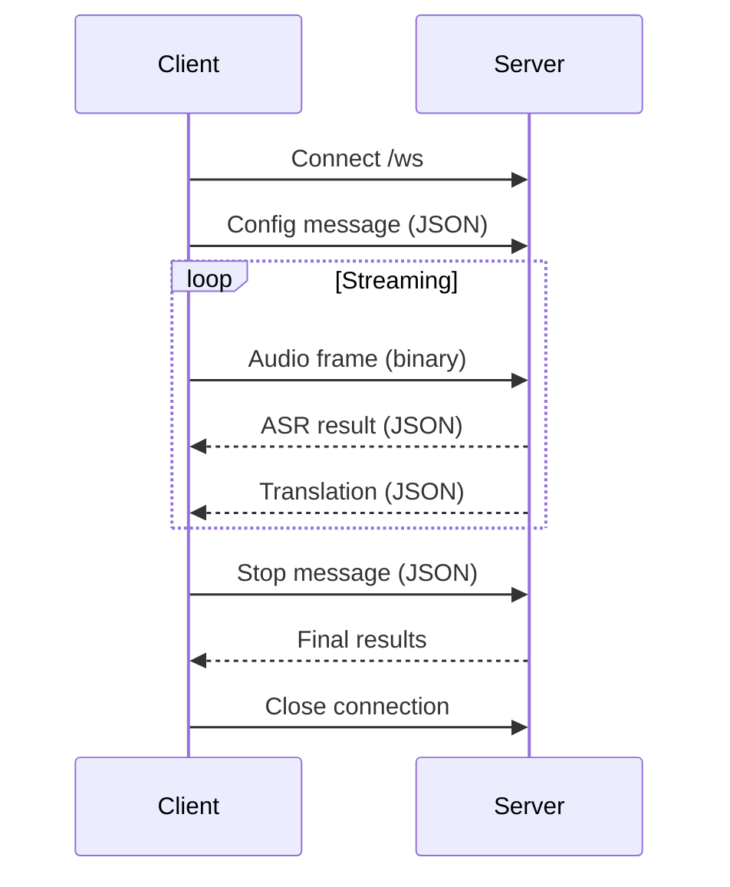

# API Reference

LinguaGap provides both REST and WebSocket APIs.

## HTTP Endpoints

### Health Check

```
GET /health
```

Returns service health status.

**Response:**

```json
{"status": "ok"}
```

### Metrics

```
GET /metrics
```

Returns performance metrics from the last streaming session.

**Response:**

```json
{
  "asr_times": [0.234, 0.189, ...],
  "mt_times": [0.456, 0.523, ...],
  "tick_count": 42,
  "total_audio_sec": 21.5
}
```

### ASR Smoke Test

```
GET /asr_smoke
```

Runs a quick ASR model test.

**Response:**

```json
{"status": "ok", "transcription": "..."}
```

### MT Smoke Test

```
GET /mt_smoke
```

Runs a quick MT model test.

**Response:**

```json
{"status": "ok", "translation": "..."}
```

### File Upload Transcription

```
POST /transcribe_translate
```

Upload an audio file for transcription and translation.

**Request:**

- Content-Type: `multipart/form-data`
- Body: `file` (audio file), `src_lang` (optional), `tgt_lang` (optional)

**Response:**

```json
{
  "segments": [
    {
      "id": 0,
      "start": 0.0,
      "end": 2.5,
      "text": "Hello world",
      "translation": "Hallo Welt"
    }
  ]
}
```

### Web UI

```
GET /
```

Serves the web UI (static/index.html).

## WebSocket API

### Connection

```
WebSocket /ws
```

Connect to begin real-time streaming.

### Message Flow



### Config Message

Sent immediately after connection to configure the session.

```json
{
  "type": "config",
  "src_lang": "en",
  "tgt_lang": "de",
  "sample_rate": 16000
}
```

| Field | Type | Description |
|-------|------|-------------|
| type | string | Must be "config" |
| src_lang | string | Source language ISO code (e.g., "en") |
| tgt_lang | string | Target language ISO code (e.g., "de") |
| sample_rate | number | Audio sample rate (default: 16000) |

### Audio Frames

Binary PCM16 audio data sent as WebSocket binary messages.

**Format:**

- Encoding: PCM16 (signed 16-bit little-endian)
- Sample rate: 16000 Hz
- Channels: Mono (1)
- Frame size: Variable (typically 4096 samples)

### Server Messages

#### ASR Result

Sent after each ASR tick (every 0.5s).

```json
{
  "type": "asr",
  "segments": [
    {
      "id": 0,
      "abs_start": 0.0,
      "abs_end": 2.5,
      "src": "Hello world",
      "src_lang": "en",
      "final": false
    },
    {
      "id": 1,
      "abs_start": 2.5,
      "abs_end": 5.0,
      "src": "How are you",
      "src_lang": "en",
      "final": true
    }
  ],
  "detected_lang": "en"
}
```

| Field | Type | Description |
|-------|------|-------------|
| type | string | "asr" |
| segments | array | List of transcribed segments |
| segments[].id | number | Unique segment ID |
| segments[].abs_start | number | Absolute start time (seconds) |
| segments[].abs_end | number | Absolute end time (seconds) |
| segments[].src | string | Transcribed text |
| segments[].src_lang | string | Detected language |
| segments[].final | boolean | True if segment is finalized |
| detected_lang | string | Overall detected language |

#### Translation Result

Sent when a segment translation completes.

```json
{
  "type": "translation",
  "segment_id": 1,
  "translation": "Wie geht es dir",
  "tgt_lang": "de"
}
```

| Field | Type | Description |
|-------|------|-------------|
| type | string | "translation" |
| segment_id | number | ID of translated segment |
| translation | string | Translated text |
| tgt_lang | string | Target language |

#### Error Message

Sent when an error occurs.

```json
{
  "type": "error",
  "message": "Error description"
}
```

#### Summary Result

Sent after conversation summarization.

```json
{
  "type": "summary",
  "summary": {
    "en": "English summary text",
    "de": "German summary text"
  }
}
```

### Stop Message

Send to stop recording and finalize remaining segments.

```json
{
  "type": "stop"
}
```

### Request Summary

Request a conversation summary.

```json
{
  "type": "request_summary"
}
```

## Error Codes

| Code | Description |
|------|-------------|
| 1000 | Normal closure |
| 1001 | Going away |
| 1011 | Server error |
| 4000 | Invalid config |
| 4001 | Audio processing error |
| 4002 | Translation error |

## Rate Limits

- Max audio buffer: 30 seconds
- ASR tick interval: 0.5 seconds
- Max concurrent WebSocket connections: Limited by server resources
