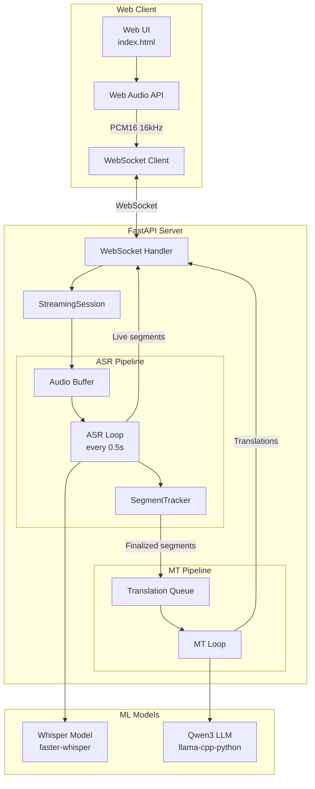
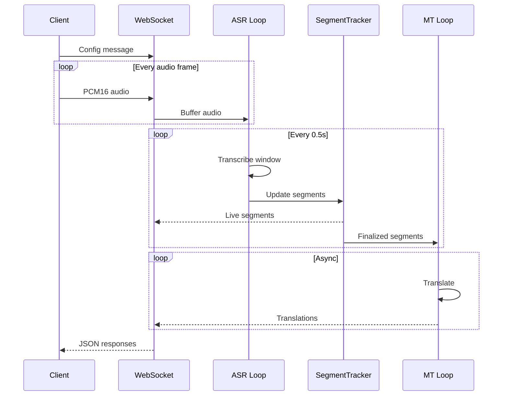
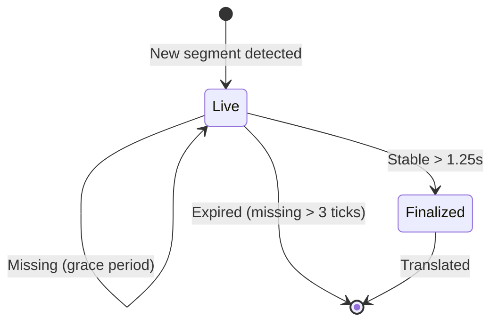

# Architecture

LinguaGap is built as a decoupled pipeline with separate ASR and MT processing stages connected via async queues.

## System Overview



## Components

### ASR Module (`src/app/asr.py`)

Automatic Speech Recognition using faster-whisper with CTranslate2 backend.

**Key Features:**

- Lazy-loaded singleton model
- GPU acceleration with CUDA
- Configurable compute type (float16/int8)
- Returns segments with word-level timestamps

**Entry Point:**

```python
from app.asr import get_model, transcribe_wav_path

model = get_model()  # Singleton
result = transcribe_wav_path("/path/to/audio.wav")
```

### MT Module (`src/app/mt.py`)

Machine Translation using Qwen3 LLM via llama-cpp-python.

**Key Features:**

- Lazy-loaded singleton LLM
- Full GPU offloading (`n_gpu_layers=-1`)
- Uses `/no_think` suffix to disable Qwen's thinking mode
- Supports 17 language pairs
- Conversation summarization with validation

**Entry Points:**

```python
from app.mt import get_llm, translate_texts, summarize_conversation

llm = get_llm()  # Singleton
translations = translate_texts(["Hello"], "en", "de")
summary = summarize_conversation(segments)
```

### Streaming Engine (`src/app/streaming.py`)

WebSocket handler managing real-time audio processing.

**StreamingSession Class:**

- Manages PCM16 audio buffer (max 30 seconds)
- Runs ASR loop every `TICK_SEC` (0.5s default)
- Processes 8-second sliding window
- Queues finalized segments for translation
- Tracks metrics (latency, throughput)

**Processing Flow:**



### Streaming Policy (`src/app/streaming_policy.py`)

Segment tracking and finalization logic.

**SegmentTracker Class:**

- Tracks finalized and live segments
- Finalization threshold: `STABILITY_SEC` (1.25s default)
- Grace period for missing segments: `LIVE_SEGMENT_GRACE_TICKS` (3 ticks)
- Overlap-based segment matching (50% threshold)

**Segment Lifecycle:**



### Web UI (`static/index.html`)

Single-page application for real-time display.

**Features:**

- Web Audio API microphone capture
- Downsampling to 16kHz PCM16
- Dual-language chat bubble layout
- Auto-scrolling transcript panes
- Language selection dropdowns
- Recording controls

## Data Flow

### Audio Processing

1. Browser captures audio at native sample rate
2. Web Audio worklet downsamples to 16kHz
3. PCM16 frames sent via WebSocket (binary)
4. Server buffers audio (max 30 seconds)

### Transcription

1. ASR loop triggers every 0.5 seconds
2. Last 8 seconds of audio extracted
3. Whisper transcribes with timestamps
4. SegmentTracker processes hypothesis

### Segment Finalization

1. New segments matched to existing by overlap
2. Segments updated with latest text/timing
3. Segments older than `now - STABILITY_SEC` finalized
4. Finalized segments queued for translation
5. Missing segments tracked with grace period

### Translation

1. MT loop processes translation queue
2. Qwen3 translates with language-specific prompt
3. Results sent back via WebSocket
4. UI updates corresponding segment

## Model Details

### Whisper (ASR)

| Property | Value |
|----------|-------|
| Model | deepdml/faster-whisper-large-v3-turbo-ct2 |
| Backend | CTranslate2 |
| Device | CUDA |
| Compute Type | float16 (configurable) |

### Qwen3 (MT)

| Property | Value |
|----------|-------|
| Model | Qwen/Qwen3-14B-GGUF |
| File | Qwen3-14B-Q4_K_M.gguf |
| Backend | llama-cpp-python |
| GPU Layers | All (-1) |
| Context | 2048 tokens |
