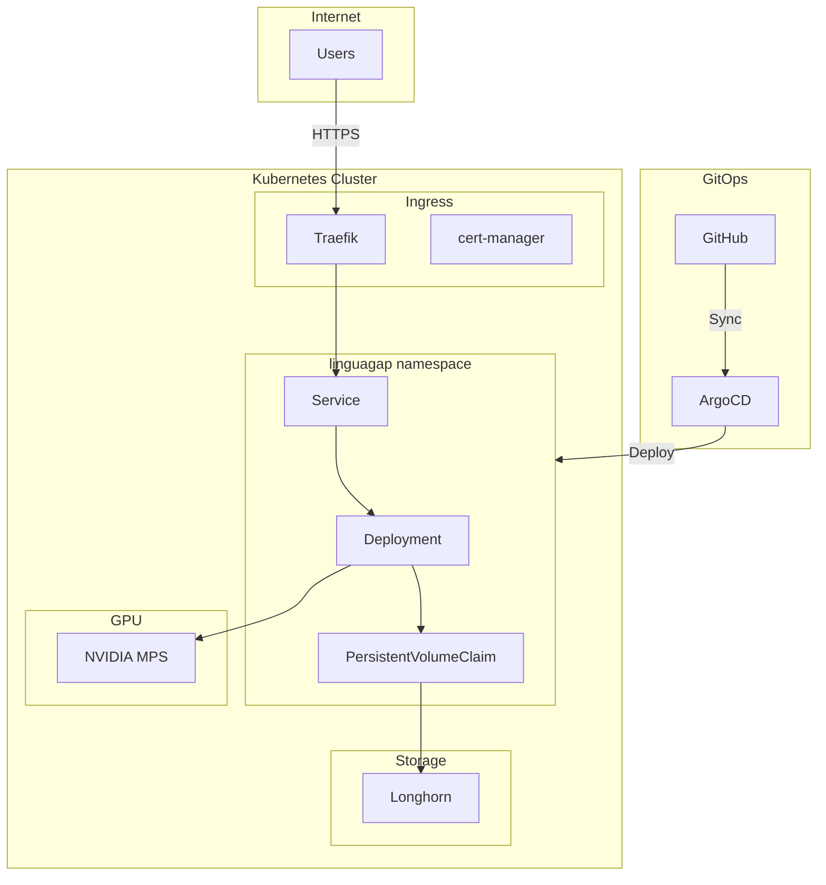
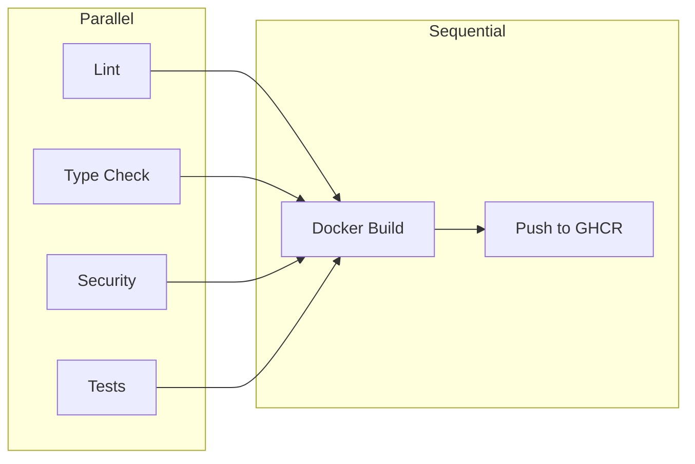

# Deployment

LinguaGap can be deployed locally with Docker Compose or to Kubernetes via ArgoCD.

## Local Development

### Prerequisites

- Docker with NVIDIA Container Toolkit
- NVIDIA GPU with CUDA support
- ~16GB GPU memory recommended

### Docker Compose

```bash
# Start the backend service
docker compose up --build backend

# View logs
docker compose logs -f backend

# Run smoke tests
docker compose exec backend python -m app.scripts.asr_smoke
docker compose exec backend python -m app.scripts.mt_smoke

# Stop
docker compose down
```

### GPU Verification

Test GPU availability:

```bash
docker compose run --rm gpu-smoke
```

Expected output shows `nvidia-smi` output with GPU info.

### First Run

On first run, models are downloaded from HuggingFace:

1. Whisper model (~1.5GB)
2. Qwen3 model (~8-10GB depending on variant)

This may take several minutes. Models are cached in the `hf-cache` volume.

## Kubernetes Deployment

### Architecture



### ArgoCD Setup

The deployment is managed by ArgoCD. The application definition:

```yaml
apiVersion: argoproj.io/v1alpha1
kind: Application
metadata:
  name: linguagap
  namespace: argocd
spec:
  project: default
  source:
    repoURL: https://github.com/johannhartmann/linguagap
    targetRevision: HEAD
    path: chart
  destination:
    server: https://kubernetes.default.svc
    namespace: linguagap
  syncPolicy:
    automated:
      prune: true
      selfHeal: true
```

### Quick Build & Deploy

Complete workflow to build, push, and deploy changes:

```bash
# 1. Commit your changes
git add -p  # stage specific changes
git commit -m "Your commit message"
git push origin feature/your-branch

# 2. Build Docker image
docker build -t ghcr.io/johannhartmann/linguagap:latest .

# 3. Push to GitHub Container Registry
docker push ghcr.io/johannhartmann/linguagap:latest

# 4. Trigger rollout restart (pulls new image)
argocd app actions run linguagap restart \
  --kind Deployment \
  --resource-name linguagap

# 5. Monitor rollout (optional, takes ~5-10 min for model warmup)
kubectl rollout status deployment/linguagap -n linguagap --timeout=600s
```

**Note:** The pod takes 5-10 minutes to become ready due to model warmup. The readiness probe is configured with a 600s initial delay.

### Sync and Deploy

```bash
# Login to ArgoCD
argocd login <argocd-server>

# Sync the application (for Helm chart changes)
argocd app sync linguagap

# Check status
argocd app get linguagap

# Rollout restart (after image update)
argocd app actions run linguagap restart \
  --kind Deployment \
  --resource-name linguagap
```

### View Logs

```bash
# Stream logs
kubectl logs -n linguagap deployment/linguagap -f

# Get pod status
kubectl get pods -n linguagap

# Describe pod
kubectl describe pod -n linguagap -l app.kubernetes.io/name=linguagap
```

### Health Check

```bash
# Via kubectl exec
kubectl exec -n linguagap deployment/linguagap -- \
  curl -s http://localhost:8000/health

# Via ingress
curl https://linguagap.data.mayflower.tech/health
```

## CI/CD Pipeline

### GitHub Actions Workflow

The CI pipeline (`.github/workflows/ci.yml`) runs on every push:



### Jobs

| Job | Purpose | Tools |
|-----|---------|-------|
| Lint | Code style | ruff |
| Type Check | Static typing | ty |
| Security | Vulnerability scan | bandit |
| Test | Unit tests | pytest |
| Docker | Build & push | buildx |

### Image Tags

- `latest` - Current main branch
- `<sha>` - Git commit SHA

## Scaling Considerations

### GPU Sharing

LinguaGap uses NVIDIA MPS (Multi-Process Service) for GPU sharing:

- Multiple pods can share one GPU
- Each pod gets a fraction of GPU memory
- Useful for multi-tenant deployments

### Horizontal Scaling

!!! warning "Stateful Sessions"
    WebSocket sessions are stateful. Use sticky sessions or a single replica for now.

For horizontal scaling:

1. Configure session affinity in ingress
2. Use Redis for shared state (not yet implemented)
3. Consider separate ASR and MT services

### Resource Planning

| Workload | CPU | Memory | GPU Memory |
|----------|-----|--------|------------|
| Light (1-2 users) | 2 cores | 12GB | 12GB |
| Medium (5-10 users) | 4 cores | 16GB | 16GB |
| Heavy (10+ users) | 8 cores | 24GB | 24GB |

## Monitoring

### Metrics Endpoint

```bash
curl https://linguagap.data.mayflower.tech/metrics
```

Returns:

```json
{
  "asr_times": [...],
  "mt_times": [...],
  "tick_count": 42,
  "total_audio_sec": 21.5
}
```

### Prometheus Integration

Metrics can be scraped by Prometheus. Add annotations:

```yaml
annotations:
  prometheus.io/scrape: "true"
  prometheus.io/port: "8000"
  prometheus.io/path: "/metrics"
```

## Backup and Recovery

### Model Cache

The HuggingFace model cache is stored in a PersistentVolumeClaim. To backup:

```bash
# Create snapshot (Longhorn)
kubectl apply -f - <<EOF
apiVersion: longhorn.io/v1beta1
kind: Snapshot
metadata:
  name: linguagap-backup-$(date +%Y%m%d)
  namespace: longhorn-system
spec:
  volume: linguagap-pvc
EOF
```

### Disaster Recovery

1. Models are auto-downloaded from HuggingFace on startup
2. No persistent user data stored
3. Full recovery is automatic with new deployment
