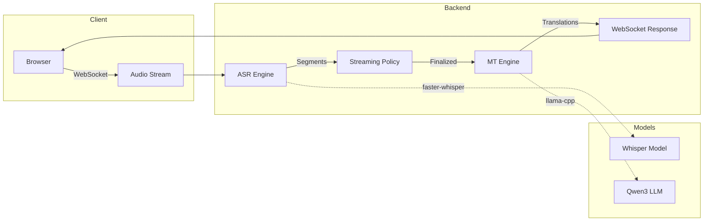

# LinguaGap

Real-time speech transcription and translation system using GPU-accelerated ASR and LLM translation.

## Features

- **Real-time transcription** using faster-whisper (CTranslate2 backend)
- **Live translation** via Qwen3 LLM with llama-cpp-python
- **WebSocket streaming** for low-latency audio processing
- **Dual-language UI** with chat bubble layout
- **17 supported languages** including European, Middle Eastern, and Slavic languages
- **Conversation summarization** with reflection-based validation
- **GPU acceleration** with NVIDIA CUDA support

## Supported Languages

| Language | Code | Language | Code |
|----------|------|----------|------|
| English | en | Russian | ru |
| German | de | Ukrainian | uk |
| French | fr | Hungarian | hu |
| Spanish | es | Arabic | ar |
| Italian | it | Persian | fa |
| Polish | pl | Serbian | sr |
| Romanian | ro | Turkish | tr |
| Croatian | hr | Albanian | sq |
| Bulgarian | bg | | |

## Quick Start

### Using Docker Compose

```bash
# Clone the repository
git clone https://github.com/johannhartmann/linguagap.git
cd linguagap

# Start with GPU support
docker compose up --build backend

# Access the UI
open http://localhost:8000
```

### Using Kubernetes

The application is deployed via ArgoCD. See the [Deployment](deployment.md) guide for details.

## Architecture Overview



## How It Works

1. **Audio Capture**: Browser captures microphone audio via Web Audio API
2. **Streaming**: PCM16 audio frames sent over WebSocket at 16kHz
3. **Transcription**: ASR processes 8-second sliding window every 0.5 seconds
4. **Finalization**: Segments become "final" after 1.25s of stability
5. **Translation**: Finalized segments queued for LLM translation
6. **Display**: Both source and translation shown in real-time

## Project Links

- [GitHub Repository](https://github.com/johannhartmann/linguagap)
- [Live Application](https://linguagap.data.mayflower.tech)
- [CI/CD Pipeline](https://github.com/johannhartmann/linguagap/actions)
